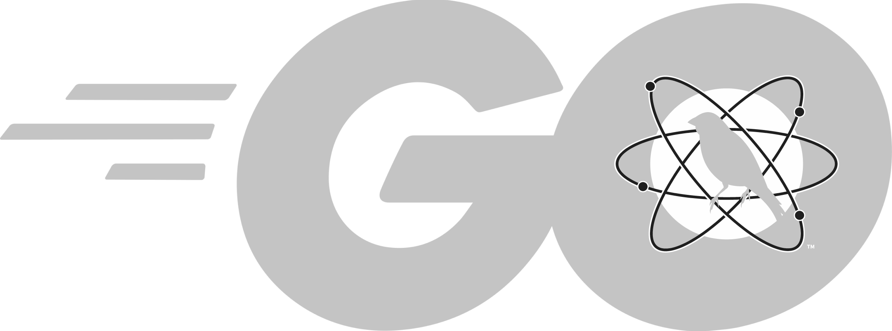

#

<div align="center">

  
  <h1>GoART</h1>

  <p>
    go-atomicredteam is a Golang application to execute tests as defined in the atomics folder of Red Canary's <a href="https://github.com/redcanaryco/atomic-red-team">Atomic Red Team</a> project.
  </p>

<!-- Badges -->

[](https://pkg.go.dev/github.com/activeshadow/go-atomicredteam) [](https://goreportcard.com/report/github.com/activeshadow/go-atomicredteam)

<h5>
    <a href="https://github.com/activeshadow/go-atomicredteam/issues/">Report Bug</a>
  <span> · </span>
    <a href="https://github.com/activeshadow/go-atomicredteam/pulls/">Contribute Features</a>
  </h5>
</div>

<br />

<!-- About the Project -->
## :star2: About the Project

The "atomics folder" contains a folder for each Technique defined by the MITRE ATT&CK™ Framework. Inside of each of these `T#` folders you'll find a yaml file that defines the attack procedures for each atomic test as well as an easier to read markdown (md) version of the same data.

- Executing atomic tests may leave your system in an undesirable state. You are responsible for understanding what a test does before executing.
- Ensure you have permission to test before you begin.
- It is recommended to set up a test machine for atomic test execution that is similar to the build in your environment. Be sure you have your collection/EDR solution in place, and that the endpoint is checking in and active.

#### Goals

The goal of go-atomicredteam (***goart*** for short) is to package all the atomic test definitions and documentation directly into the executable such that it can be used in environments without Internet access. As of now this is not fool proof, however, since some tests themselves include calls to download additional resources from the Internet.

***goart*** also supports local development of tests by making it possible for a
user to dump existing test definitions to a local directory and load tests
present in the local directory when executing. If a test is both defined
locally and within the executable, the local test will be used.

<!-- Screenshots -->
### :camera: Screenshots

<p align="center">
  
</p>

<!-- Features -->
### :dart: Features

- Standalone Atomic Red Team Executor
- Supports Windows, MacOS, and Linux (assuming it's cross-compiled).
- Makefile to download atomics to build **_goart_**

<!-- Config Variables -->
### :key: Config Variables

#### Using Assets Provided With An Atomic

- Sometimes, atomic tests need to bring their own tools or config files with them.
This is supported, and a good example to reference is the atomic for
`T1003.004`. To make use of `PsExec.exe` automatically as referenced in the
test, it would simply need to be added to the `include/atomics/T1003.004/bin`
directory before `go-atomicredteam` is rebuilt.

- The key is the `PathToAtomicsFolder` string included in the default argument for
the `psexec_exe` input argument. This string will be replaced with the
appropriate path, depending on if it's a default test, a custom test, or a local
test. In this case it's a default test, so `PathToAtomicsFolder` is replaced
with `include/atomics` before trying to access the file.

<!-- Getting Started -->
## :toolbox: Getting Started

<!-- Prerequisites -->
### :bangbang: Prerequisites

This project uses Golang:

- Following the [install instructions](https://go.dev/doc/install) to install Golang.
- Optional: A test system (e.g. VM, spare laptop, etc.) to run ***goart***

<!-- Run Locally -->
### :running: Build: Go Package

To build ***goart*** for all operating systems, simply run `make release` from
the root directory. Otherwise, run the appropriate `make bin/goart-<os>`
target for your OS.


Clone the project

```bash
  git clone https://github.com/activeshadow/go-atomicredteam
```

Go to the project directory

```bash
  cd go-atomicredteam
```

Optionally update dependencies if receiving `//go:linkname must refer to declared function or variable` error

```bash
  go get -u && go mod tidy
  go get -u golang.org/x/sys
```

Build ***goart***

```bash
  # All operating systems
  make release

  # Or target operating system
  make bin/goart-<os>
```

Run ***goart***

```bash
  goart --help
```

<!-- Usage -->
## :eyes: Usage

```bash
  # Run the goart command
  goart --help
```

<!-- Running Tests -->
### :test_tube: Running Tests

WIP: Run tests

```bash
  go test
```

<!-- License -->
## :warning: License

Distributed under the MIT License. See [LICENSE](LICENSE) for more information.
